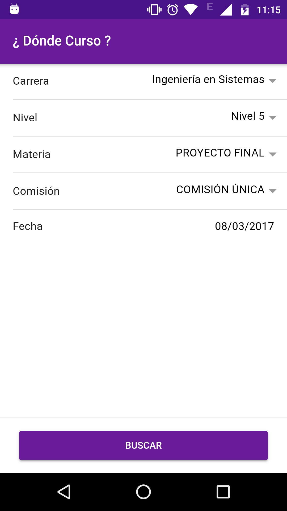
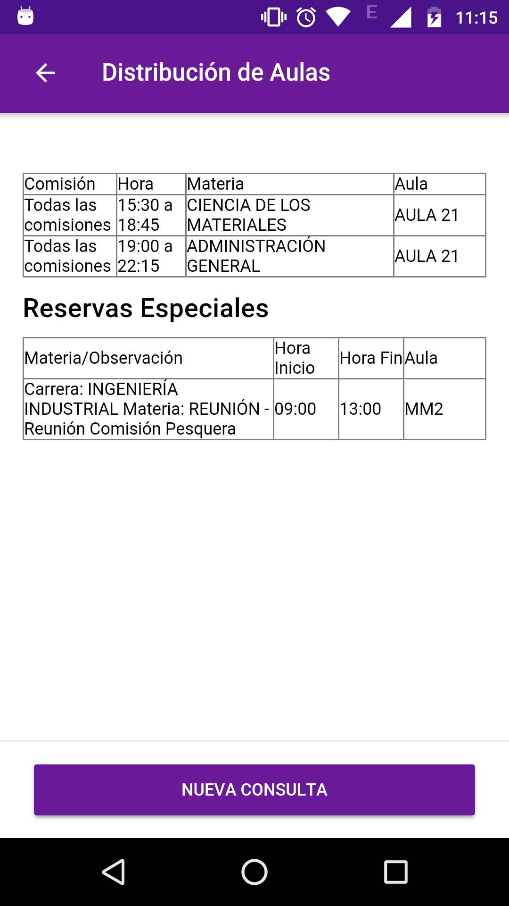

# ¿ Dónde Curso?

  

## Tabla de Contenidos

- [Screenshots](#screenshots)
- [Descarga](#descarga)
- [Descripción](#descripción)
- [Autores](#autores)
- [Colaboradores](#colaboradores)
- [Tecnologías](#tecnologías)
- [Quiero colaborar](#quiero-colaborar)
- [Licencia](#licencia)

## Screenshots

  
  

## Descarga

[Ultimo Build](https://github.com/bertilxi/DC/releases/latest)

## Descripción

**Esta aplicación no es oficial**

La aplicación oficial para la UTN FRSF es una aplicación híbrida desarrollada en cordova.
 
Esta aplicación surgió debido a que la anterior no escala bien en resoluciones de 1080p o más.
 
Se desarrollo usando IONIC 2 framework, el cual se apoya en cordova, pero utilizando lo último de las tecnologías web y teniendo un adecuado soporte para las distintas resoluciones de los dispositivos móviles.
 
Esta aplicación fue desarrollada desde cero y no tiene ninguna relación con la aplicación oficial.
 
Solo se reutilizó la misma API Rest usada por la aplicación oficial.

## Autores

* **Fernando Berti** - [bertilxi](https://github.com/bertilxi)

## Colaboradores

* **Daniel Campodonico** - [DCampodonico](https://github.com/DCampodonico)

## Quiero colaborar

Abri un issue, mandame un mail o hace un pull request
 
La aplicación esta abierta a sugerencias y mejoras

## Tecnologías 

- Ionic 2

## Licencia

Este proyecto esta licenciado bajo MIT. Ver [LICENSE.md](LICENSE.md) para mas detalles
